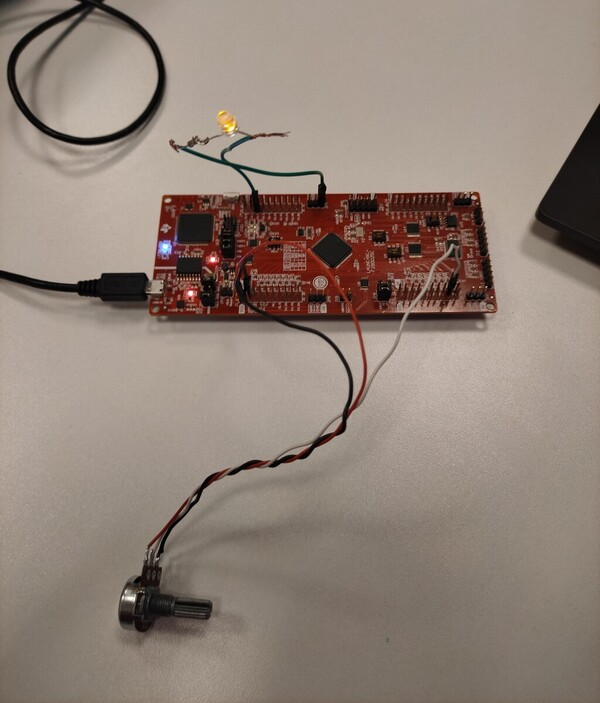
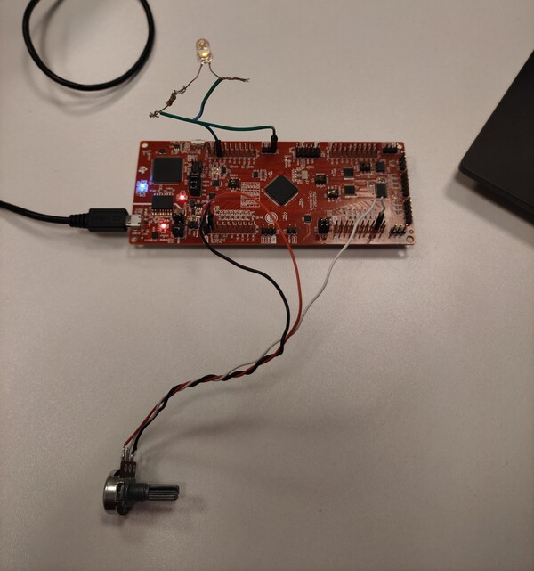
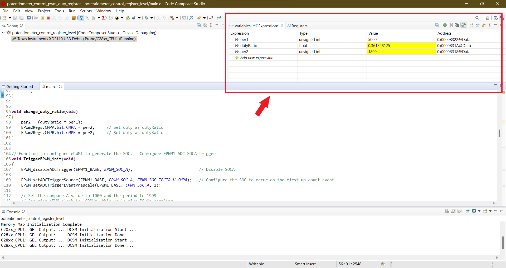

<br/>
<p align="center">
  <a href="https://github.com/talhaturac/Potentiometer_Control_PWM_Duty">
    
  </a>

  <h1 align="center">Building Embedded Software Using the LAUNCHXL-F280025C Development Kit</h1>

  <h3 align="center">
    This project is developed to control the duty cycle of PWM signals with a potentiometer.
    <br/> 
    The PWM is controlled at register level "without using EPWM_configureSignal()"
    <br/> 
    <br/>
  </h3>


## Table Of Contents

* [About the Project](#about-the-project)
* [Built With](#built-with)
* [Description](#description)
* [Contact and Feedback](#contact-and-feedback)

<br/>

## About The Project

<p align="center">
  <a href="https://github.com/talhaturac/Potentiometer_Control_PWM_Duty/tree/main/images">
    
  </a>

I am actively working on development kits from Texas Instruments and developing embedded software. In this post here, I wanted to share one of the projects I have done so that you can benefit from it. Enjoy!

Why are we here:

* To create projects from Code Composer Studio IDE.
* To be able to use the ADC unit, read and use this data.
* To generate and configure PWM signals.
* To be able to set the duty cycle ratio and other parameters of the PWM signal.

You can experiment by customizing the project code to your own TI development board. Or you can use the information shared here to create your own customizations that use the ADC unit and ePWM unit. The actual code is in the main.c file. 

<p align="center">
  <a href="https://github.com/talhaturac/Potentiometer_Control_PWM_Duty/tree/main/images">
    
  </a>

<br/>

<p align="center">
  <a href="https://github.com/talhaturac/Potentiometer_Control_PWM_Duty/tree/main/images">
    
  </a>

## Built With

It was built using the C programming language, via Code Composer Studio IDE, with the LAUNCHXL-F280025C (C2000 MCUs family) development kit from Texas Instruments.
             

* [Code Composer Studio IDE -> version 11.0.0.00012](https://www.ti.com/tool/download/CCSTUDIO/11.0.0.00012)
* [C2000Ware Library -> version 4.00.00.00](https://www.ti.com/tool/download/C2000WARE/4.00.00.00)
* [F280025C LaunchPad™ development kit for C2000™ real-time MCU](https://www.ti.com/tool/LAUNCHXL-F280025C)


<br/>

## Description

Firstly, an empty CCS project file is opened. Required adjustments and configurations are made. After selecting the target path, i.e. the target device and connection type, the software is started. The reason why I do not share about these parts in detail is that they are available on the internet and TI's own resources. 

The software is started by including the libraries on the main.c file.
In this section, the included libraries are "driverlib.h" and "device.h". These files contain the drivers for the microcontroller and define the device-specific constants.
```
#include "driverlib.h"
#include "device.h"
```

The prototypes of the used functions are defined in this section. This enhances the readability and maintenance of the code.
```
// Function Prototypes
void    ADC_init();
void    ASYSCTL_init();
void    INTERRUPT_init();
void    PinMux_init();
void    TriggerEPWM_init();
void    EPWM2_init();
void    change_duty_ratio();
extern __interrupt void adcA1ISR(void);
```

This section contains the definitions of global variables used in the code, such as ADC results, duty ratio, and other variables.
```
// GLOBALS
uint16_t   adcAResult0;
float32_t  dutyRatio;
float32_t  d_value = 0;
```

This function contains the necessary steps to initialize EPWM2. It configures GPIO pins, resets PWM2 peripheral, and sets up synchronization.
```
void EPWM2_init()
```

This function is used to change the PWM duty ratio. It calculates the duty cycle of the PWM signal based on the ADC value and configures the PWM signal.
```
void change_duty_ratio(void)
```

This function configures EPWM1 as a trigger for ADC. It sets up timing and frequency parameters.
```
void TriggerEPWM_init(void)
```

This functions initializes and configures the ADC. It sets ADC sampling triggers, interrupts, and other settings.
```
__interrupt void adcA1ISR(void)
void ADC_init()
void INTERRUPT_init()
```

These function disables the temperature sensor output to the ADC.
```
void ASYSCTL_init()
```

This function sets up the configuration of analog pins.
```
void PinMux_init()
```

The main function initializes the device and performs necessary settings. It calls a function in an infinite loop to change the PWM duty cycle based on the ADC reading.
```
void main(void)
```
<br/>

In order to test the results, a 330 ohm resistor and an LED lamp are connected in series between the GPIO2 pin and the 3.3V pin of the development board. The red end of the potentiometer is connected to 3.3V, the black end to the GND pin and the white pin to the A0/C15 pin. The connection and pinout reference of the development board can be found with [F280025C LaunchPad™ quick quide resource.](https://www.ti.com/lit/ug/spruiw5a/spruiw5a.pdf?ts=1709207015516&ref_url=https%253A%252F%252Fwww.google.com%252F)
<br/>
<br/>

Let's turn the potentiometer and see what happens!


<br/>

## Contact and Feedback

* [![GITHUB][github.com]][github-url]

* [![LinkedIn][LinkedIn.com]][LinkedIn-url]

* If you have any feedback, please contact me at tturac.turk@gazi.edu.tr e-mail address.
  
[github.com]: https://img.shields.io/badge/GITHUB_PROFILE-181717?style=for-the-badge&logo=github&logoColor=white
[github-url]: https://github.com/talhaturac
[LinkedIn.com]: https://img.shields.io/badge/LINKEDIN_PROFILE-0A66C2?style=for-the-badge&logo=LinkedIn&logoColor=white
[LinkedIn-url]: https://www.linkedin.com/in/talhaturacturk
